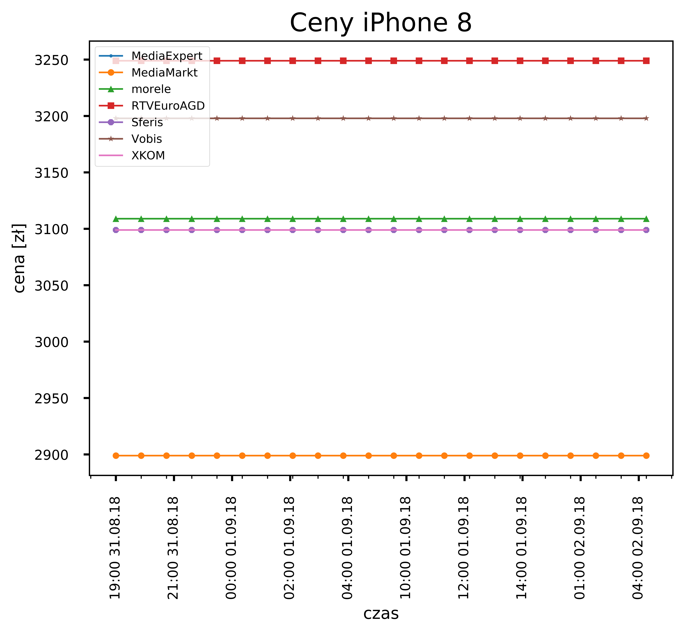

#iPhone pricing monitor

* install dependiences
```bash
pip3 install lxml matplotlib
apt install python3-tk
```

* test
```bash
python3 main.py
```

* run automatically
```cron
crontab -e
```
and paste
```cron
0 * * * * cd /path/to/folder && python3 main.py &
```

* effect
